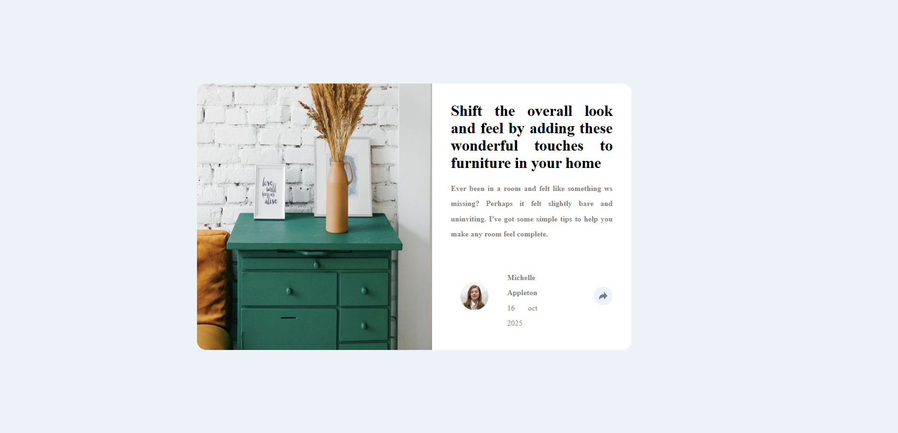
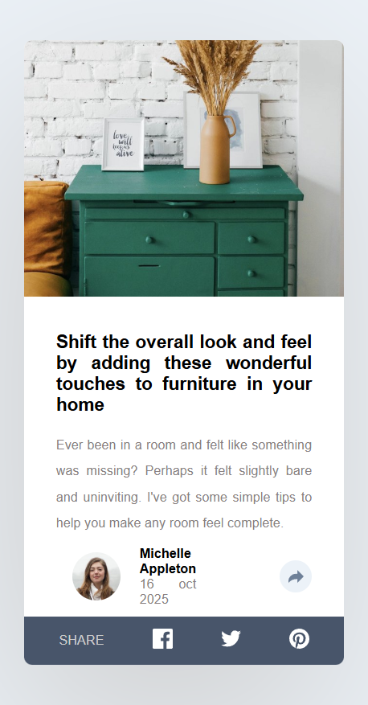

# Frontend Mentor - Article preview component solution

This is a solution to the [Article preview component challenge on Frontend Mentor](https://www.frontendmentor.io/challenges/article-preview-component-dYBN_pYFT). Frontend Mentor challenges help you improve your coding skills by building realistic projects. 

## Table of contents

  - [The challenge](#the-challenge)
  - [Screenshot](#screenshot)
  - [Links](#links)
- [My process](#my-process)
  - [Built with](#built-with)
  - [What I learned](#what-i-learned)
  - [Continued development](#continued-development)
  - [Useful resources](#useful-resources)
- [Author](#author)
- [Acknowledgments](#acknowledgments)

### The challenge

Users should be able to:

- View the optimal layout for the component depending on their device's screen size
- See the social media share links when they click the share icon

### Screenshot

### Links

- Solution URL: [Add solution URL here](https://your-solution-url.com)
- Live Site URL: [Add live site URL here](https://your-live-site-url.com)

## My process
## My Process

**What does this function do?**  
It hides the "Share" link by default and opacity it only when the "Share" icon is clicked.

**Why did I write it?**  
This was implemented to fulfill the project’s interactivity requirements and to provide a smoother user experience.

**How does it work?**  
When the user clicks the "Share" icon, the "Share" link appears, allowing access to multiple social media sharing options with a single click.

**What problem does it solve?**  
It offers users a quick and convenient way to share content on different social platforms, improving accessibility and usability.

### Built with

- Semantic HTML5 markup
- CSS custom properties
- Flexbox
- Mobile-first workflow
-

### What I learned

learn how to debug and also how to use the js with css properties

// shareLink.style.display = "block"; 
// shareLink.style.display = "flex"; 

### Continued development

I am still not fluent with the js's uses with logic and css 

### Useful resources

- (github.com/copilot) - This helped me for improve my js knowledge and help me to debugs learn new pattern reason. I really liked this pattern and will use it going forward.
- (discort) - This is an amazing platform which helped me finally understand get proper feedback, code pattern and logic from others. I'd recommend it to anyone still learning this for becoming a good developer.

## Author

- Frontend Mentor - [Lovely](https://www.frontendmentor.io/profile/yourusername)

## Acknowledgments
AI, fireshot, frontend mentor and google for helpin me with this project .